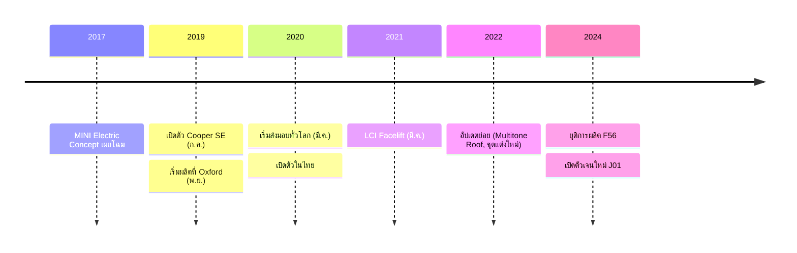

# Model History — MINI Cooper SE (F56 BEV)

## Summary

MINI Cooper SE เป็นรถยนต์ไฟฟ้าล้วน (BEV) รุ่นแรกที่ผลิตจำนวนมากของ MINI พัฒนาบนตัวถัง F56 (3-door hatch) โดยยกชุดขับเคลื่อนหลักมาจาก BMW i3s ผลิตที่โรงงาน Oxford ประเทศอังกฤษ ระหว่างปลายปี 2019 ถึงต้นปี 2024 ก่อนถูกแทนที่ด้วย MINI Cooper E/SE เจนใหม่ (J01) ที่ผลิตในจีน

## Key Points

- เปิดตัวอย่างเป็นทางการ: กรกฎาคม 2019 · เริ่มผลิต: พฤศจิกายน 2019 · เริ่มส่งมอบ: มีนาคม 2020
- พื้นฐานตัวถัง F56 hatch 3 ประตู — มิติภายนอกแทบเท่ารุ่นเครื่องยนต์สันดาป
- มอเตอร์ไฟฟ้าแบบ hybrid-synchronous 135 kW (184 แรงม้า) / 270 Nm ขับเคลื่อนล้อหน้า (พื้นฐานจาก BMW i3s)
- แบตเตอรี่ Li-ion 32.6 kWh (ใช้งานจริง ~28.9 kWh) วางรูปตัว T ใต้พื้นรถ จุดศูนย์ถ่วงต่ำกว่ารุ่นเบนซิน
- 0–100 กม./ชม. 7.3 วินาที · ความเร็วสูงสุดจำกัดที่ 150 กม./ชม. · น้ำหนักตัวถัง ~1,365 กก.
- ระยะทาง WLTP ประมาณ 203–234 กม. (ขึ้นกับล้อ/สเปก)
- ประเทศไทย: เปิดตัวประมาณปี 2020 นำเข้าทั้งคัน (CBU) จากอังกฤษ ราคาเปิดตัวประมาณ 2.29 ล้านบาท *(ต้องยืนยันตัวเลขทางการ)*
- ยุติการผลิตต้นปี 2024 พร้อมการเปลี่ยนผ่านสู่เจนใหม่ J01 (Cooper E/SE ไฟฟ้า ผลิตที่จีน)

## Timeline โดยย่อ

ดูรายละเอียดเต็มใน [[01 Overview/Timeline]]

## ตำแหน่งของรุ่นในตลาด

| ประเด็น | รายละเอียด |
| --- | --- |
| จุดขาย | ความสนุกแบบ go-kart + ความเป็น MINI แท้ (ผลิต Oxford) |
| จุดอ่อนหลัก | ระยะทางต่อชาร์จสั้นเมื่อเทียบกับคู่แข่งยุคเดียวกัน |
| กลุ่มผู้ใช้เหมาะสม | รถคันที่สองในเมือง เดินทางวันละไม่เกิน ~150 กม. |

## References

- MINI / BMW Group press release เปิดตัว Cooper SE (2019) — *ต้องเก็บลิงก์เข้า [[09 Resources]]*
- ข้อมูลสเปกทางการ MINI Thailand — *รอเอกสาร brochure ใน Inbox*

## Related Notes

- [[01 Overview/Model Year Differences]]
- [[01 Overview/LCI Changes]]
- [[03 Battery/Battery Technology]]
- [[08 Comparison/Cooper SE vs Cooper S]]

## Questions

- สเปกไทยแต่ละปีต่างจากสเปกยุโรปอย่างไร (heat pump, ล้อ, option)?
- จำนวนรถ Cooper SE ที่จดทะเบียนในไทยทั้งหมดมีกี่คัน?

## Next Research

- หา brochure ไทยปี 2020–2023 มาเก็บใน [[09 Resources]]
- ยืนยันราคาเปิดตัวและราคาปรับปรุงแต่ละปีจาก MINI Thailand

**Last Updated:** 2026-07-20
