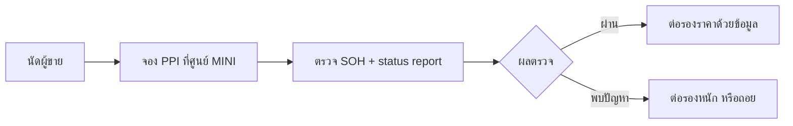

# Dealer Inspection — การตรวจสภาพที่ศูนย์ก่อนซื้อ

## Summary

การนำรถเข้าตรวจที่ศูนย์ MINI (Pre-Purchase Inspection) เป็นด่านคัดกรองที่คุ้มค่าที่สุดสำหรับ EV มือสอง เพราะข้อมูลสำคัญที่สุด — สุขภาพแบตเตอรี่, recall คงค้าง, ประวัติเซอร์วิส — อ่านได้จากระบบของศูนย์เท่านั้น

## Key Points

- สิ่งที่ควรขอจากศูนย์:
  1. **Battery SOH / capacity test** พร้อมเอกสารผลตรวจ → [[03 Battery/Battery SOH]]
  2. **Vehicle status report** (error code ค้างในระบบ)
  3. **Recall / technical campaign คงค้าง** ของ VIN นี้
  4. **ประวัติเซอร์วิสในระบบ** (ถ้าเจ้าของเดิมเข้าศูนย์ตลอด จะเห็นครบ)
- จุดที่ช่างควรตรวจเพิ่ม: แผ่นใต้ท้อง/เคสแบต, ระบบระบายความร้อนแบต, heat pump, on-board charger (KLE), ช่วงล่าง
- รถที่ผู้ขายไม่ยอมให้เข้าศูนย์ตรวจ = สัญญาณเตือนสำคัญ

## ขั้นตอนแนะนำ

- ตกลงกันก่อนว่าใครจ่ายค่าตรวจ (ธรรมเนียมทั่วไป: ผู้ซื้อจ่าย แลกกับสิทธิ์รู้ข้อมูล)
- ถ้าซื้อจากดีลเลอร์/เต็นท์: ขอเอกสารตรวจสภาพ + เงื่อนไขรับประกันของเต็นท์เป็นลายลักษณ์อักษร

## References

- *(รอข้อมูลราคา PPI จากศูนย์ MINI ไทย)*

## Related Notes

- [[02 Buying Guide/Buying Checklist]] · [[03 Battery/Battery SOH]] · [[05 Problems/Recall]]

## Questions

- ศูนย์ MINI สาขาไหนในไทยรับตรวจ PPI ให้รถที่ยังไม่ใช่ของเรา และคิดเท่าไร?

## Next Research

- โทรสอบถามศูนย์ MINI 2–3 สาขา บันทึกราคา/เงื่อนไขไว้ในหน้านี้

**Last Updated:** 2026-07-20
