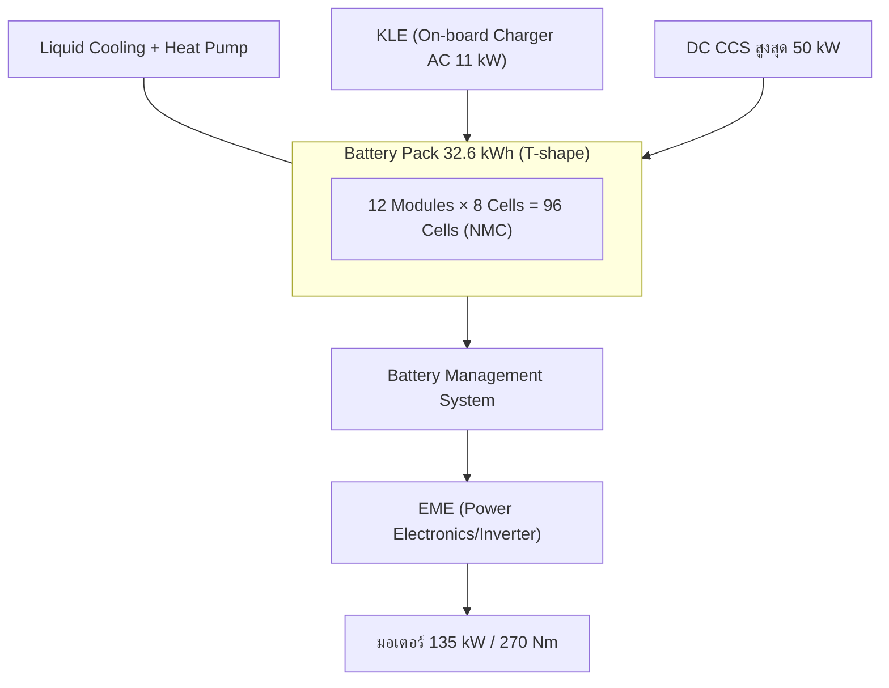

# Battery Technology — เทคโนโลยีแบตเตอรี่ Cooper SE

## Summary

Cooper SE ใช้แบตเตอรี่ลิเธียมไอออนชนิด NMC ความจุรวม 32.6 kWh (ใช้งานจริง ~28.9 kWh) จัดวางรูปตัว T ใต้พื้นรถ พัฒนาต่อยอดจากแพลตฟอร์มแบตของ BMW i3 ซึ่งมีประวัติความทนทานดีที่สุดรุ่นหนึ่งในอุตสาหกรรม จุดแข็งคือระบบจัดการความร้อนแบบ liquid cooling และ buffer ที่ BMW กันไว้ค่อนข้างมาก

## Key Points

- **ความจุ:** 32.6 kWh gross / ~28.9 kWh usable — buffer ~11% ช่วยชะลอการเสื่อม
- **เคมี:** Lithium-ion NMC (Nickel Manganese Cobalt)
- **โครงสร้าง:** 96 เซลล์ / 12 โมดูล วางรูปตัว T (แนวอุโมงค์กลาง + ใต้เบาะหลัง) — ตำแหน่งเดียวกับถังน้ำมันเดิม จึงไม่กินพื้นที่ห้องโดยสาร
- **ระบายความร้อน:** ของเหลว (liquid cooled) เชื่อมกับระบบแอร์/heat pump
- **แรงดันระบบ:** ~350V class
- **น้ำหนักชุดแบต:** ~200 กก. อยู่ต่ำสุดของรถ → จุดศูนย์ถ่วงต่ำกว่า Cooper S เบนซิน ~30 มม.
- **ที่มา:** สถาปัตยกรรมเซลล์/โมดูลร่วมตระกูลกับ BMW i3 (120Ah) ซึ่งมีข้อมูลอายุการใช้งานจริงสะสมนับสิบปี → เป็นข่าวดีต่อความเชื่อมั่นระยะยาว

## แผนภาพ

## ศัพท์ที่ต้องรู้ (โผล่บ่อยในใบแจ้งซ่อม)

| ตัวย่อ | คือ | เกี่ยวข้องกับ |
| --- | --- | --- |
| BMS | ระบบจัดการแบตเตอรี่ | SOH, การชาร์จ |
| EME | ชุดอิเล็กทรอนิกส์กำลัง/inverter | recall บางรายการ → [[05 Problems/Recall]] |
| KLE | on-board charger (AC) | อาการชาร์จ AC ไม่เข้า |
| SME | ชุดควบคุมแบตแรงดันสูง | เก็บข้อมูล SOH |

## References

- BMW Group technical press material, MINI Cooper SE (2019–2020) — *รอเก็บลิงก์เข้า Resources*

## Related Notes

- [[03 Battery/Battery SOH]] · [[03 Battery/Charging]] · [[03 Battery/Battery Aging]] · [[03 Battery/Battery Replacement]]

## Questions

- เซลล์ผลิตโดย supplier รายใด (CATL/Samsung SDI?) และมีผลต่ออะไหล่ทดแทนไหม?

## Next Research

- หาเอกสาร teardown/รายงานเทคนิคของ pack นี้มาเก็บใน [[09 Resources]]

**Last Updated:** 2026-07-20
